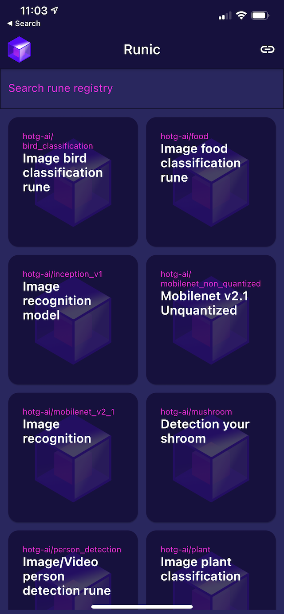
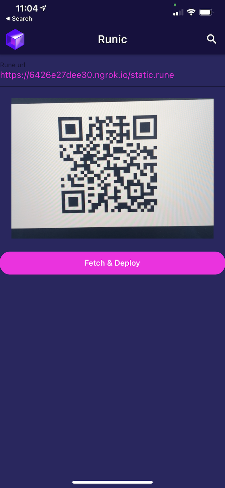

# rune-serve
**Simple HTTP/Ngrok Serve to quick serve your Rune**

rune-serve is a nifty docker based tool/utility that will help you test runes that you develop on edge devices. 

rune-serve uses [ngrok](https://ngrok.com/) which is provides a public URL for your localhost application. Note: we do not maintain or own ngrok.

## Why do I need rune-serve
[Runes](https://github.com/hotg-ai/rune) let you build and containerize TinyML apps that are portable across several host embedded environments. 

While building runes, you will need an efficient way to test them directly on devices you are building them for. rune-serve is your nifty `server` to make the runes available for download via a url.

## Mobile ready
We have built `Runic` app which allows you to dynamicall load a rune file and test it. 
You can find Runic app in the app store: [iOS](https://apps.apple.com/us/app/runic-by-hotg-ai/id1550831458) and [Android - pending approval]().

You can use the App's load from url feature to test your Rune on the phone.




run-serve lets you create a QR code that can be quickly deciphered to a URL that downloads a rune file.

## How to use

1. Anywhere on your system that you want to host your rune file:
``` mkdir static ```

2. Copy over your .rune file in to the static folder.

3. Rename the .rune file to static.rune (this is a temporary hack, we will make it more configurable) 

4. Run the rune-serve as a docker container:
``` docker run -e RUST_LOG=INFO -v `pwd`/static:/app/static tinyverseml/rune-serve ```

5. When the server runs it will show an ngrok url. Go to the url and scan the QR code in the runic-mobile app.